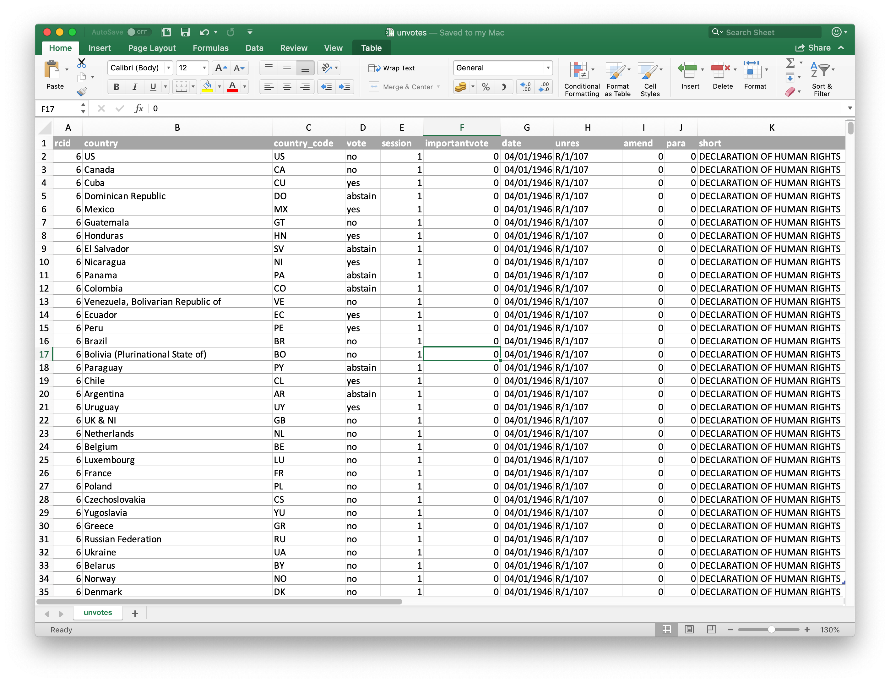
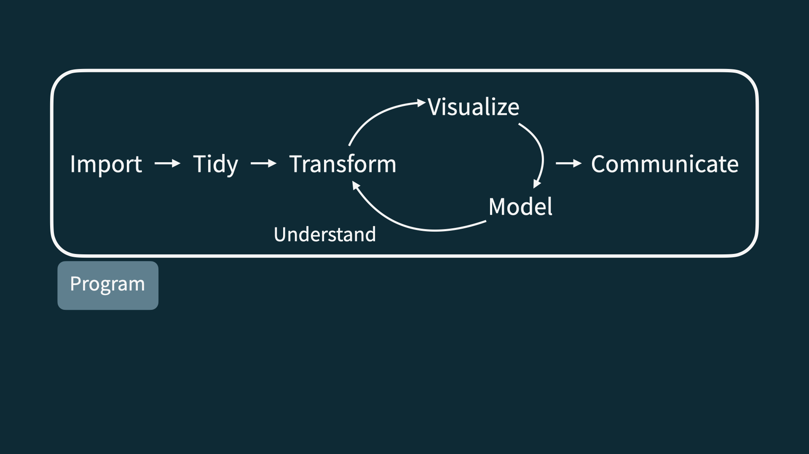

```{r setup, include=FALSE}
options(htmltools.dir.version = FALSE)

library(knitr)
library(tidyverse)
library(xaringan)
library(dataedu)
library(here)

#joro_years <- round(as.numeric(difftime(as.Date(Sys.Date()), Sys.getenv("joro_bday"), unit="weeks"))/52.25, 1)
```

# Agenda

1. A brief introduction to learning analytics using R
1. First activity: Visualizing data in RStudio!
1. Check-out

---

class: inverse, center, middle

# Part 1/3: Introductions

---

## FAQ

.pull-left-wide[
**Q - What learning analytics does this lab assume?**  
A - None.

**Q - Will we be doing computing?**   
A - Yes.

**Q - Is this an intro to CS/coding?**  
A - No, but many themes are shared.

**Q - What computing language will we learn first?**  
A - R.
]

---
  
```{r echo=FALSE, out.width="75%", fig.align="left"}

```


---

```{r echo=FALSE, out.width="50%", fig.align="left"}
knitr::include_graphics("./img/r.png")
```

---

```{r echo=FALSE, out.width="73%", fig.align="left"}
knitr::include_graphics("./img/rstudio.png")
```

---

```{r echo=FALSE, out.width="90%", fig.align="left"}
knitr::include_graphics("./img/data-science-cycle/data-science-cycle.001.png")
```

---

```{r echo=FALSE, out.width="90%", fig.align="left"}
knitr::include_graphics("./img/data-science-cycle/data-science-cycle.002.png")
```

---

```{r echo=FALSE, out.width="90%", fig.align="left"}
knitr::include_graphics("./img/data-science-cycle/data-science-cycle.003.png")
```

---

```{r echo=FALSE, out.width="90%", fig.align="left"}
knitr::include_graphics("./img/data-science-cycle/data-science-cycle.004.png")
```

---

```{r echo=FALSE, out.width="90%", fig.align="left"}
knitr::include_graphics("./img/data-science-cycle/data-science-cycle.005.png")
```

---

```{r echo=FALSE, out.width="90%", fig.align="left"}
knitr::include_graphics("./img/data-science-cycle/data-science-cycle.006.png")
```

---

## A tibble

```{r echo=FALSE}
travel <- tribble(
  ~date,              ~season,
  "23 January 2017",  "winter",
  "4 March 2017",     "spring",
  "14 June 2017",     "summer",
  "1 September 2017", "fall",
  "...", "..."
)

travel
```

---

```{r echo=FALSE, out.width="90%", fig.align="left"}
knitr::include_graphics("./img/data-science-cycle/data-science-cycle.007.png")
```

---

```{r echo=FALSE, out.width="90%", fig.align="left"}
knitr::include_graphics("./img/data-science-cycle/data-science-cycle.008.png")
```

---

```{r echo=FALSE, out.width="90%", fig.align="left"}

```

---

# Why learn R?

* It is capable of carrying out basic and complex statistical analyses
* It is able to work with data small (*n* = 30) and large (*n* = 100,000+) efficiently
* It is a programming language and so is quite flexible
* There is a great, inclusive community of users and developers (and teachers)
* It is increasingly used in education
* It can help you to carry out your educational analyses in open and trustworthy ways
* It is cross-platform, open-source, and freely-available

---

# RMarkdown

* RMarkdown is a data analysis "notebook" that combines text with code and output
* It is a great file type to use when beginning to use R and to create reproducible analyses
* It is fun to use because you can generate different types of output (Word, PDF, and even web-based)

---

# Let's look at a bit of code together

What do you think this code will do?

```{r, eval = FALSE}
sci_mo_processed %>% 
  filter(percentage_earned >= .60) %>% 
  select(student_id, course_id, percentage_earned))
```

---

# Let's look at a bit of code together

```{r}
sci_mo_processed %>% 
  filter(percentage_earned >= .60) %>% 
  select(student_id, course_id, percentage_earned)
```

---

# Let's look at a bit of code together

What do you think this code will do?

```{r, eval = FALSE}
sci_mo_processed %>% 
  filter(percentage_earned >= .60) %>% 
  arrange(desc(percentage_earned)) %>% 
  select(student_id, course_id, percentage_earned, TimeSpent)
```

---

# Let's look at a bit of code together

```{r}
sci_mo_processed %>% 
  filter(percentage_earned >= .60) %>% 
  select(student_id, course_id, percentage_earned, TimeSpent)
```

---

# First small group tutorial: Data viz!

- Navigate to https://github.com/laser-institute/intro-to-learning-analytics-using-r/find/main
- Begin to type "tutorials"
- Find `tutorials-learning-lab-1.Rmd`
- Download this file by right-clicking it and then open it within RStudio
- Walk through the steps

---

# Discuss in groups (or, if there is insufficient time, in Slack)

- What is one thing you learned from this part?
- What questions do you still have?
