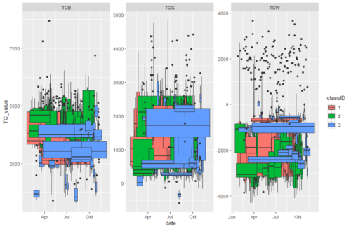
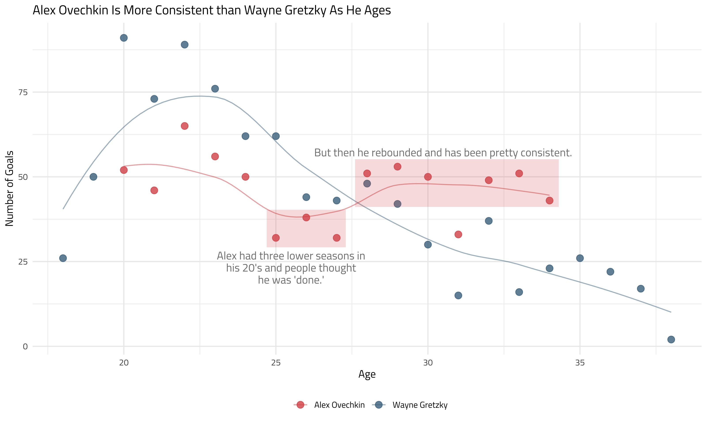

class: clear, title-slide, inverse, center, top, middle

```{r setup, include=FALSE}
knitr::opts_chunk$set(echo = FALSE)
```

```{r, echo=FALSE}
# then load all the relevant packages
pacman::p_load(pacman, knitr, xaringanExtra)
```

```{r xaringan-panelset, echo=FALSE}
xaringanExtra::use_panelset()
```

```{r xaringanExtra-clipboard, echo=FALSE}
# these allow any code snippets to be copied to the clipboard so they 
# can be pasted easily
htmltools::tagList(
  xaringanExtra::use_clipboard(
    button_text = "<i class=\"fa fa-clipboard\"></i>",
    success_text = "<i class=\"fa fa-check\" style=\"color: #90BE6D\"></i>",
  ),
  rmarkdown::html_dependency_font_awesome()
)
```
```{r xaringan-extras, echo=FALSE}
xaringanExtra::use_tile_view()

```

# `r rmarkdown::metadata$title`
----
### `r rmarkdown::metadata$author`
### `r format(Sys.time(), "%B %d, %Y")`

---
# Outline for this presentation

1. Setting the stage for the learning labs
2. A quick look at RStudio Cloud
3. A framework for thinking about your work with R
4. Looking ahead to the learning lab

---

#  1. Setting the stage for the learning labs

You'll be doing three primary things during the learning labs:

- _Running_ R code that we wrote
- _Modifying_ that R code to achieve your goal
- _Writing R code_ from scratch to solve a particular problem

---

#  1. Setting the stage for the learning labs

These learning labs have a few features:

- **Situated** in STEM education contexts
- **Scaffolded** to provide you opportunities to learn about the R code and why you might use or write R code how you are 
- **Allow multiple paths** to completing: in a more _guided_ (with a LASER team member) mode or peer groups
- Are associated with _reach_ **opportunities to do more**, chances for you to apply what you have learned
with your own data (or to your own context)
- Are accompanied by **just-in-time support** from peers and us as you need it

---

# 2. A quick look at RStudio Cloud

Let's take a peak at the Getting Started activty as the context for this: 

https://rstudio.cloud/spaces/140883/project/2564884

---

# 3. A framework for thinking about your work with R

- As STEM education researchers, it is important to us to consider _how_ we make sense of 
using R and doing learning analytics

   - frameworks and mental models are a big part of how we do this "sense-making"
   
- Here, we'll focus on the **foundational skills framework**
  - this framework is for the key technical components of your use of R 
  - this complements the _process_ of the *LASER cycle* 

---

# 3. A framework for thinking about your work with R

- The **foundational skills framework** has four parts

  - *R Studio Projects*: How you organize your analyses that are a part of the same over-arching research project or analysis
  - *Functions*: How you take steps to work with your data; functions have names and arguments: `my_function(the_argument)`
  - *Packages*: What you install and load to extend the functionality of R; packages provide you with new functions
  - *Data and your environment*: Data is the main object on which functions operate; data is loaded into your environment and you often have multiple data frames loaded at once

---

# 4. Looking ahead to the learning lab

Learning R is very hard! We all create figures like this:

```{r, echo = FALSE, out.width = "50%"}

```

https://accidental-art.tumblr.com/

---

# 4. Looking ahead to the learning lab

But, using R, we can also create figures like this:

```{r, echo = FALSE, out.width = "50%"}

```

(One of many plots from [Isabella Velásquez](https://ivelasq.rbind.io/), a guest speaker)

---

# 4. Looking ahead to the learning lab

The **Learning Analytics Foundations** module will help scholars to become familiar with the process of doing learning analytics in the statistical software and programming language R. This learning lab will focus on the foundational skills undergirding all work in R. We'll also emphasize effective visualization and a soup-to-nuts analysis of digital and other sources of data in the context of a study of online science classes.

---

# 4. Looking ahead to the learning lab

In this lab, **Learning Lab 1**, we'll wrangle a complex source of digital data exported from a course learning management system (LMS). We do this in service of creating a faceted plot of the time students spent on the course. 

---
class: clear, inverse, middle, center

**R you ready for R?**

----

Let's proceed to running, modifying, and running R code in RStudio Cloud!

Head over to the LASER Learning Lab space to get started: https://rstudio.cloud/projects

**Click Learning Analytics Foundations** then *laf-learning-lab-1.Rmd* to begin**
