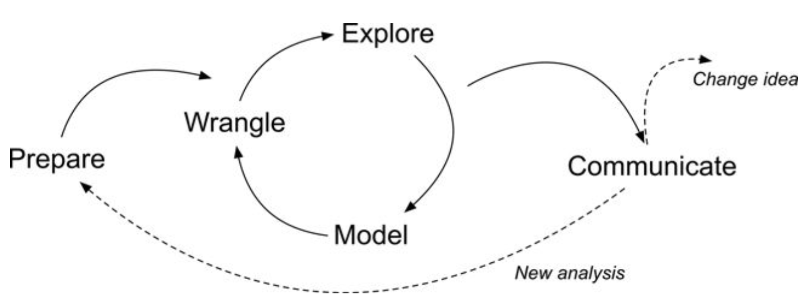

class: clear, title-slide, inverse, center, top, middle

```{r setup, include=FALSE}
knitr::opts_chunk$set(echo = FALSE)
```

```{r, echo=FALSE}
# then load all the relevant packages
pacman::p_load(pacman, knitr, xaringanExtra)
```

```{r xaringan-panelset, echo=FALSE}
xaringanExtra::use_panelset()
```

```{r xaringanExtra-clipboard, echo=FALSE}
# these allow any code snippets to be copied to the clipboard so they 
# can be pasted easily
htmltools::tagList(
  xaringanExtra::use_clipboard(
    button_text = "<i class=\"fa fa-clipboard\"></i>",
    success_text = "<i class=\"fa fa-check\" style=\"color: #90BE6D\"></i>",
  ),
  rmarkdown::html_dependency_font_awesome()
)
```
```{r xaringan-extras, echo=FALSE}
xaringanExtra::use_tile_view()

```

# `r rmarkdown::metadata$title`
----
### `r rmarkdown::metadata$author`
### `r format(Sys.time(), "%B %d, %Y")`

---

# Outline for this presentation

1. Running code efficiently
2. Squashing bugs (via Slack)
3. More on the *LASER cycle*
4. Looking ahead to the learning lab

---

#  1. Running code efficiently

By now, you've run a lot of R code - good work!

There are a number of ways to run R code

We'll briefly review a few of them in the context of the upcoming learning lab:
https://rstudio.cloud/spaces/140883/project/2635100

---

#  2. Squashing bugs (via Slack)

In this learning lab, you'll have one task not directly related to running, modifying, and writing R code: Creating a Slack account

We will use Slack as a platform through which you can ask _and answer_ questions related to R

There is a specific channel (more on these in the learning lab!) for questions

---

# 2. Squashing bugs (via Slack)

There are many ways to ask questions and _all are very welcome_

It is very likely others have the same question; you asking it serves everyone (and it helps us, too)

---

# 2. Squashing bugs (via Slack)

**Tips on posing questions in Slack**:

1. Provide as much information as you can: what are you trying to do and what is happening?
2. What file are you working in and on what lines/what section?
3. Screen shots can be helpful, too

**Other tips**:

1. You can _always_ answer your peers' questions
2. Consider checking to see whether your question has been asked before

---

# 3. The LASER cycle

```{r, echo = FALSE}

```

---

# 3. The LASER cycle

**Prepare**

- Developing a question or purpose for the analysis 
- This part of the process also involves developing an understanding of the data and what you may need to analyze the data
- This often involves looking at the data and its documentation

---

# 3. The LASER cycle

**Wrangle**

- Cleaning and processing data, and, in cases, merging (or joining) data from multiple sources
- Often, this part of the process is very (surprisingly) time-intensive
- Wrangling your data into shape can itself be an important accomplishment

---

# 3. The LASER cycle

**Explore**

- Describing your data such as by calculating the means and standard deviations of numeric variables
- Also, often, visualizing your data to understand the distribution of variables and their relations with others

---

# 3. The LASER cycle

**Model**

- Simplifying and summarizing our data
- Models can take many forms, from relatively straightforward (calculating a _mean_) to
complex (multi-level and machine learning models)

---

# 3. The LASER cycle

**Communicate**

- Sharing what we have done or found internally (with collaborators) or externally (with others, including the public)
- We can communicate both _our code_ and _its output_ (and our _interpretation of it_)
- Communication often leads to either new analyses or changing one's understanding of something

---

# 4. Looking ahead to the learning lab

This lab focuses on the common challenge of working with two files in the same analysis. Such a challenge typically requires joining together these data sets. We join data on the time students spent on the course LMS with data on students' academic achievement. We then create plots of the relations between these two key measures. 

---

class: clear, inverse, middle, center

**R you ready for R?**

----

Let's go!

We'll again be organized around **guided** and **self-directed** groups. 

Head over to the LASER Learning Lab space to get started: https://rstudio.cloud/projects
